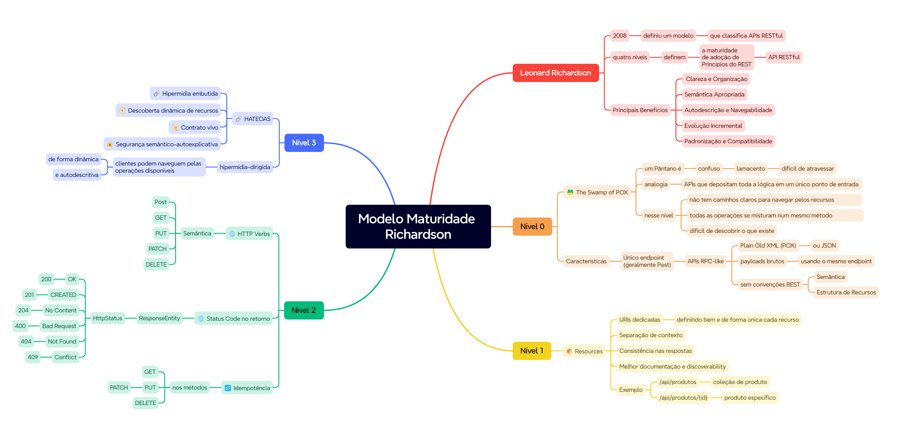

# 🧭✨  Níveis de Maturidade de Richardson

Os níveis de maturidade de Richardson é um modelo que classifica APIs RESTful em quatro níveis, cada um representando um grau crescente de complexidade e conformidade com os princípios REST. 

## 🚀 Introdução ao Modelo

Em 2008, Leonard Richardson propôs um modelo de maturidade para classificar o grau de “RESTfulness” de uma API — ou seja, o quão alinhada ela está aos princípios do REST.

* **Leonard Richardson**: Autor do Modelo de Maturidade de Richardson, criado para orientar a evolução incremental de APIs rumo a práticas REST mais completas.

* **📚 REST**:
    * **REST (Representational State Transfer)**: é um estilo arquitetural para construir serviços web que utilizam os verbos HTTP para manipular recursos.
    * **⚙️ Princípios REST**:
        * **🔌 Stateless**: cada requisição deve conter todas as informações necessárias para ser processada.
        * **🌐 Recursos**: os recursos são identificados por URLs e manipulados através de verbos HTTP.
        * **🖼️ Representações**: os recursos podem ser representados em diferentes formatos, como JSON ou XML.
    * **💡 Benefícios do REST**:
        * **✨ Simplicidade** e **📈 Escalabilidade*.
        * **🔒 Independência** entre cliente e servidor.
        * ** 🛠️ Integração** fácil com diversas plataformas.


* **📚 RESTful**: Adjetivo que descreve APIs que seguem rigorosamente os princípios do REST (uso correto de verbos, URIs semânticas, códigos de status, etc.).
* **📚 RESTfulness**: Substantivo (um neologismo) usado para medir o “nível de REST” de uma API. É perfeitamente aceitável em contextos técnicos para indicar “o quão RESTful” um serviço é.


Segue abaixo uma visão geral dos quatro níveis do modelo de maturidade de Richardson, que vão desde APIs simples e monolíticas até sistemas complexos e autodescritivos:
  


---


## Nível 0 - 🐸 The Swamp of POX

Neste nível inicial, a API se comporta como um **endpoint RPC-like**, concentrando toda a lógica em um único ponto de entrada:

### ✨ Principais Características:
- **🌊 Endpoint único**: todas as operações são realizadas através de um único endpoint, geralmente usando

- **📥 Unidade de acesso**: todas as requisições usam POST /api, sem URIs específicas para recursos.

- **📥 POX (Plain Old XML/JSON)**: payloads são transmitidos de forma bruta, sem media types ou convenções REST adicionais.

- **❌ Semântica HTTP não explorada**: não há distinção entre operações (criar, ler, atualizar, excluir) via verbos HTTP—tudo é POST.


### Origem do nome:

- **🐸 Swamp (“pântano”)**: ilustra o caos de um único endpoint que mistura diversas operações.

- **📥 POX (“Plain Old XML/JSON”)**: destaca o uso de payloads simples e não estruturados.

### Exemplo em Spring Boot:
```java
@RestController
@RequestMapping("/api")
public class RpcController {
    @PostMapping
    public ResponseEntity<Object> handle(@RequestBody Map<String, Object> request) {
        String action = (String) request.get("action");
        // Lógica de roteamento via switch/case
        Object result = service.execute(action, request);
        return ResponseEntity.ok(result);
    }
}
```

---


## Nível 1 – 📦 Resources

No segundo estágio do modelo de Richardson, passamos a organizar nossa API em **recursos bem definidos**, cada um com a sua própria URI. Ainda não exploramos totalmente a semântica dos verbos HTTP (isso fica para o Nível 2), mas já obtemos ganhos significativos em clareza e manutenção.

### ✨ Principais características
- **🏷️ URIs dedicadas a coleções e itens**  
  - `/api/produtos` → coleção de produtos  
  - `/api/produtos/{id}` → produto específico
- **🔍 Separação de contexto**  
  Cada URI reflete um recurso distinto, facilitando o entendimento do escopo das operações.
  * **📚 URI**: URI (Uniform Resource Identifier) é um identificador padronizado utilizado na web para nomear e localizar recursos de forma única e consistente. Ele serve como um endereço que permite identificar qualquer recurso, seja ele uma página HTML, uma imagem, um serviço REST, um documento ou mesmo uma representação abstrata.

- **📁 Consistência nas respostas**  
  Mesmo que usemos sempre POST ou GET indiscriminadamente, a organização por recursos já torna a API mais previsível.
- **📝 Melhor documentação e discoverability**  
  Ferramentas como Swagger/OpenAPI conseguem inspecionar e descrever cada recurso de maneira mais clara.

### Exemplo ilustrativo (Spring Boot)
```java
@RestController
@RequestMapping("/api/vendedores")
public class VendedorController {

    // Lista todos os vendedores (pode ser GET ou POST, mas já está no escopo correto)
    @RequestMapping(method = RequestMethod.POST)
    public List<Vendedor> listar() {
        return service.findAll();
    }

    // Retorna um vendedor específico
    @RequestMapping(path = "/{id}", method = RequestMethod.POST)
    public Vendedor buscar(@PathVariable Long id) {
        return service.findById(id);
    }

    // Cria um novo vendedor
    @RequestMapping(method = RequestMethod.POST, path = "/criar")
    public Vendedor criar(@RequestBody Vendedor v) {
        return service.save(v);
    }
}
```

- **Observação:** Mesmo que, nesse nível, ainda não estejamos usando os verbos HTTP de forma ideal (por exemplo, usando POST ou GET para todas as operações), a separação de recursos já melhora a estrutura da API e facilita a evolução futura.


---

## Nível 2 - 🌐 HTTP Verbs

No terceiro nível do modelo de Richardson, aproveitamos a semântica dos verbos HTTP para mapear operações CRUD em endpoints RESTful. Cada verbo HTTP assume um papel específico na manipulação de recursos, e os status codes indicam o resultado da operação.

### ✨ Principais Características

* **👀 GET**: Recupera recursos.
* **➕ POST**: Cria novos recursos.
* **🔄 PUT**: Atualiza ou substitui recursos existentes.
* **✂️ PATCH**: Atualização parcial de recursos.
* **🗑️ DELETE**: Remove recursos.
* **🔁 Idempotência**: GET, PUT e DELETE devem ser idempotentes; POST não.

    * **📚 Idempotência**: É a propriedade de uma operação que, quando executada repetidamente com os mesmos parâmetros, produz sempre o mesmo efeito e não causa alterações adicionais após a primeira execução. Isso garante segurança em sistemas distribuídos, pois previne inconsistências ao lidar com requisições duplicadas.

### 🌐 Códigos de Status Comuns

| Código              | Significado                              | Exemplo de Uso               |
| ------------------- | ---------------------------------------- | ---------------------------- |
| **200 OK**          | Operação bem-sucedida                    | GET `/api/produtos`          |
| **201 Created**     | Recurso criado                           | POST `/api/produtos`         |
| **204 No Content**  | Recurso excluído ou atualizado sem corpo | DELETE `/api/produtos/1`     |
| **400 Bad Request** | Solicitação inválida                     | Campos obrigatórios faltando |
| **404 Not Found**   | Recurso não encontrado                   | GET `/api/produtos/999`      |
| **409 Conflict**    | Conflito de recurso                      | POST com ID já existente     |

### Exemplo em Spring Boot

```java
@RestController
@RequestMapping("/api/produtos")
public class ProdutoController {

    private final ProdutoService service;

    public ProdutoController(ProdutoService service) {
        this.service = service;
    }

    @GetMapping
    public ResponseEntity<List<Produto>> listar() {
        List<Produto> lista = service.findAll();
        return ResponseEntity.ok(lista); // 200 OK
    }

    @GetMapping("/{id}")
    public ResponseEntity<Produto> buscar(@PathVariable Long id) {
        return service.findById(id)
            .map(p -> ResponseEntity.ok(p)) // 200 OK
            .orElse(ResponseEntity.status(HttpStatus.NOT_FOUND).build()); // 404 Not Found
    }

    @PostMapping
    public ResponseEntity<Produto> criar(@RequestBody Produto p) {
        Produto criado = service.save(p);
        URI uri = ServletUriComponentsBuilder.fromCurrentRequest()
            .path("/{id}")
            .buildAndExpand(criado.getId())
            .toUri();
        return ResponseEntity.created(uri).body(criado); // 201 Created
    }

    @PutMapping("/{id}")
    public ResponseEntity<Void> atualizar(@PathVariable Long id, @RequestBody Produto p) {
        if (!service.existsById(id)) {
            return ResponseEntity.status(HttpStatus.NOT_FOUND).build(); // 404 Not Found
        }
        p.setId(id);
        service.save(p);
        return ResponseEntity.noContent().build(); // 204 No Content
    }

    @PatchMapping("/{id}")
    public ResponseEntity<Produto> atualizarParcial(@PathVariable Long id, @RequestBody Map<String, Object> updates) {
        return service.partialUpdate(id, updates)
            .map(updated -> ResponseEntity.ok(updated)) // 200 OK
            .orElse(ResponseEntity.status(HttpStatus.NOT_FOUND).build()); // 404 Not Found
    }

    @DeleteMapping("/{id}")
    public ResponseEntity<Void> deletar(@PathVariable Long id) {
        if (!service.existsById(id)) {
            return ResponseEntity.status(HttpStatus.NOT_FOUND).build(); // 404 Not Found
        }
        service.deleteById(id);
        return ResponseEntity.noContent().build(); // 204 No Content
    }
}
```

### Observações
- **🔁 Idempotência**: GET, PUT e DELETE devem ser idempotentes, ou seja, múltiplas requisições com os mesmos parâmetros devem ter o mesmo efeito.
- **🌐 Status Codes**: Use códigos de status HTTP apropriados para indicar o resultado das operações, melhorando a comunicação entre cliente e servidor.
- **📝 Documentação**: Mantenha a documentação da API atualizada e clara, facilitando o entendimento e uso por parte dos desenvolvedores.


---


## Nível 3 – 🔗 HATEOAS

No quarto nível do modelo de Richardson, além de recursos bem definidos (nível 1) e uso correto dos verbos HTTP e status codes (nível 2), introduzimos **HATEOAS** (Hypermedia As The Engine Of Application State). Aqui, cada resposta retorna não só os dados do recurso, mas também links navegáveis que orientam o cliente sobre as próximas ações possíveis, garantindo que a API seja **autodescritiva** e hipermídia-dirigida.

### ✨ Principais Características

* **🔗 Hipermídia embutida**
  As representações dos recursos incluem um conjunto de links (`_links`) que apontam para operações relacionadas (autorreferência, navegação em coleções, ações customizadas, etc.).
* **🧭 Descoberta dinâmica de recursos**
  O cliente não precisa conhecer antecipadamente todas as URIs da API; segue os links fornecidos nas respostas para descobrir novos pontos de interação.
* **📜 Contrato vivo**
  Alterações na estrutura de URIs ou inclusão de novas funcionalidades podem ser refletidas via novos links, minimizando *hard-coding* no cliente.
* **🔐 Segurança semântico-autoexplicativa**
  Cada link pode conter metadados (por exemplo, método HTTP suportado, tipo de mídia esperado), tornando claro ao cliente como utilizá-lo.

### Exemplo de resposta JSON com HATEOAS

```json
{
    "id": 1,
    "nome": "Produto Exemplo",
    "ncm": "12345678",
    "descricaoNcm": "Descrição do NCM",
    "preco": 99.99,
    "quantidade": 10,
    "_links": {
        "self": {
            "href": "/api/produtos/1",
            "type": "GET"
        },
        "produtos": {
            "href": "/api/produtos",
            "type": "GET"
        },
        "atualizar": {
            "href": "/api/produtos/1",
            "type": "PUT"
        },
        "deletar": {
            "href": "/api/produtos/1",
            "type": "DELETE"
        },
        "comprar": {
            "href": "/api/produtos/1/comprar",
            "type": "POST"
        }
    }
}
```

### Implementação em Spring Boot

```java
package br.com.casasbahia.crud_h2.controller;

import br.com.casasbahia.crud_h2.model.Produto;
import br.com.casasbahia.crud_h2.service.ProdutoService;
import lombok.RequiredArgsConstructor;
import org.springframework.hateoas.CollectionModel;
import org.springframework.hateoas.EntityModel;
import org.springframework.hateoas.Link;
import org.springframework.hateoas.RepresentationModel;
import org.springframework.http.HttpMethod;
import org.springframework.http.ResponseEntity;
import org.springframework.web.bind.annotation.*;

import java.net.URI;
import java.util.List;
import java.util.Optional;
import java.util.stream.Collectors;

import static org.springframework.hateoas.server.mvc.WebMvcLinkBuilder.linkTo;
import static org.springframework.hateoas.server.mvc.WebMvcLinkBuilder.methodOn;

@RestController
@RequestMapping("/api/produtos")
@RequiredArgsConstructor
public class ProdutoController {

    private final ProdutoService produtoService;

    @PostMapping
    public ResponseEntity<Produto> criar(@RequestBody Produto produto) {
        return Optional.of(produto)
                .map(produtoService::criar) // Cria o produto
                .map(saved -> URI.create("/api/produtos/" + saved.getId())) // Cria a URI do novo recurso
                .map(uri -> ResponseEntity.created(uri).body(produto)) // Retorna 201 Created com a URI e o produto
                .orElse(ResponseEntity.badRequest().build()); // Retorna 400 Bad Request se o produto for inválido
    }


    @GetMapping
    public ResponseEntity<CollectionModel<EntityModel<Produto>>> listar() {
        List<EntityModel<Produto>> recursos = produtoService.listar().stream()
                .map(p -> EntityModel.of(p,
                        linkTo(methodOn(ProdutoController.class).buscarPorId(p.getId())).withSelfRel()))
                .collect(Collectors.toList());

        return recursos.isEmpty()
                ? ResponseEntity.noContent().build()
                : ResponseEntity.ok(
                CollectionModel.of(recursos,
                        linkTo(methodOn(ProdutoController.class).listar()).withSelfRel()));
    }


    @GetMapping("/{id}")
    public ResponseEntity<EntityModel<Produto>> buscarPorId(@PathVariable Long id) {
        return produtoService.buscarPorId(id)
                .map(p -> {
                    // Monta manualmente cada link com URI relativa e type
                    Link self = Link.of("/api/produtos/" + id)
                            .withSelfRel()
                            .withType(HttpMethod.GET.name());
                    Link list = Link.of("/api/produtos")
                            .withRel("produtos")
                            .withType(HttpMethod.GET.name());
                    Link update = Link.of("/api/produtos/" + id)
                            .withRel("atualizar")
                            .withType(HttpMethod.PUT.name());
                    Link delete = Link.of("/api/produtos/" + id)
                            .withRel("deletar")
                            .withType(HttpMethod.DELETE.name());
                    Link comprar = Link.of("/api/produtos/" + id + "/comprar")
                            .withRel("comprar")
                            .withType(HttpMethod.POST.name());

                    return EntityModel.of(p, self, list, update, delete, comprar);
                })
                .map(ResponseEntity::ok)
                .orElse(ResponseEntity.notFound().build());
    }


    @PutMapping("/{id}")
    public ResponseEntity<EntityModel<Produto>> atualizar(@PathVariable Long id,
                                                          @RequestBody Produto produto) {
        return produtoService.buscarPorId(id)
                .map(existing -> {
                    produto.setId(id);
                    Produto atualizado = produtoService.atualizar(produto);
                    return EntityModel.of(atualizado,
                            linkTo(methodOn(ProdutoController.class).buscarPorId(id)).withSelfRel(),
                            linkTo(methodOn(ProdutoController.class).listar()).withRel("produtos")
                    );
                })
                .map(ResponseEntity::ok)
                .orElse(ResponseEntity.notFound().build());
    }


    @DeleteMapping("/{id}")
    public ResponseEntity<? extends RepresentationModel<?>> deletar(@PathVariable Long id) {
        return produtoService.buscarPorId(id)
                .map(p -> {
                    produtoService.deletar(id);
                    RepresentationModel<?> model = new RepresentationModel<>();
                    model.add(Link.of("/api/produtos")
                            .withRel("produtos")
                            .withType(HttpMethod.GET.name()));
                    return ResponseEntity.ok(model);
                })
                .orElseGet(() -> ResponseEntity.notFound().build());
    }


}

```


---


## 📚 Fortalecendo o Conhecimento

O código apresentado combina recursos da linguagem Java, do ecossistema Spring Boot, do Lombok e da especificação HATEOAS para construir uma API RESTful robusta. Abaixo, uma explicação dos principais recursos utilizados:


### 📚 Anotações do Spring Boot

- **@RestController**: Combina @Controller e @ResponseBody, simplificando a criação de controladores REST.
- **@RequestMapping("/api/produtos")**: Define a rota base para todos os endpoints do controlador.
- **@GetMapping, @PostMapping, @PutMapping, @DeleteMapping**: Mapeiam métodos para verbos HTTP específicos (GET, POST, PUT, DELETE).
- **ResponseEntity<>**: Representa uma resposta HTTP completa, permitindo configurar status code, headers e body.


### 📚 Lombok

- **@RequiredArgsConstructor**: Gera automaticamente um construtor que injeta a dependência final (`ProdutoService`).
- Reduz boilerplate de construtores e facilita injeção de dependências.


### 📚 Padrão Optional

- Uso de **Optional&lt;T&gt;** para tratar valores possivelmente ausentes sem lançar NullPointerException.
- Métodos como `map()` e `orElseGet()` tornam o fluxo mais claro e funcional.


### 📚 Streams e Collections

- Uso de **Streams** para processar listas:
    ```java
    produtoService.listar().stream()
        .map(...)
        .collect(Collectors.toList());
    ```

* Facilita operações de transformação e filtragem de coleções de forma declarativa.


### 📚 HATEOAS (Hypermedia as the Engine of Application State)

* **EntityModel\<T>** e **CollectionModel\<EntityModel\<T>>**: Encapsulam recursos e links.
* Construção de links navegáveis (`self`, `produtos`, `atualizar`, `deletar`, `comprar`) para tornar a API auto-descritiva.
* Auxilia clientes a descobrir operações disponíveis para cada recurso.


### 📚 Manipulação de URIs e Links

* **linkTo(methodOn(...))**: Construção programática de URIs com base em métodos de controlador.
* **Link.of(...)**: Permite criar links manuais com rel e verbos HTTP.


### 📚 Tratamento de Erros e Códigos de Status

* **ResponseEntity.noContent()** (204) quando não há recursos.
* **ResponseEntity.created(uri)** (201) para novos recursos.
* **ResponseEntity.badRequest()** (400) para requisições inválidas.
* **ResponseEntity.notFound()** (404) quando o recurso não existe.

<br>

Com HATEOAS, sua API torna-se verdadeiramente **hipermídia-dirigida**, permitindo que os clientes naveguem pelas operações disponíveis de forma dinâmica e autodescritiva, elevando a aderência aos princípios REST ao seu máximo grau.


---


## 🎯 Considerações Finais

O modelo de Maturidade de Richardson oferece um roteiro claro para a evolução de APIs RESTful, partindo de um endpoint único (POX) até uma arquitetura totalmente hipermídia-dirigida (HATEOAS). Entre os principais benefícios apresentados:

- **🗂️ Clareza e Organização**: Definir recursos e URIs específicas (Nível 1) facilita a manutenção e a compreensão da API.

- **⚡ Semântica Apropriada**: O uso correto dos verbos HTTP e códigos de status (Nível 2) melhora a comunicação entre cliente e servidor e garante comportamento previsível (idempotência).

- **🧭 Autodescrição e Navegabilidade**: Ao incorporar links HATEOAS (Nível 3), a API se torna autodescritiva, orientando clientes sobre possíveis operações e reduzindo acoplamento.

- **📈 Evolução Incremental**: Seguindo os níveis de Richardson, é possível adotar melhorias gradualmente, sem necessidade de reescrever toda a API de uma vez.

- **🔌 Padronização e Compatibilidade**: APIs alinhadas com princípios REST são mais interoperáveis, facilitando a integração com ferramentas e frameworks (Swagger, Spring HATEOAS, etc.).

Adotar esse modelo de maturidade contribui para arquiteturas mais robustas, escaláveis e fáceis de evoluir, fortalecendo boas práticas de design e aumentando a confiabilidade de serviços distribuídos.